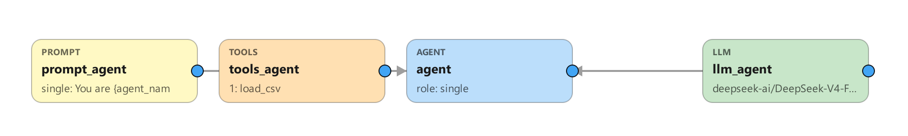
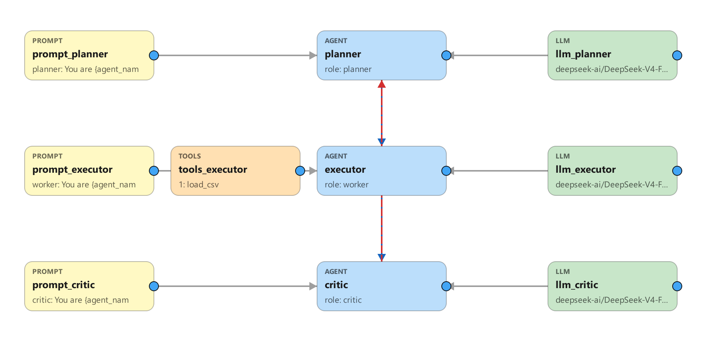
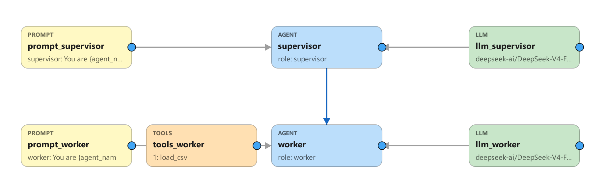
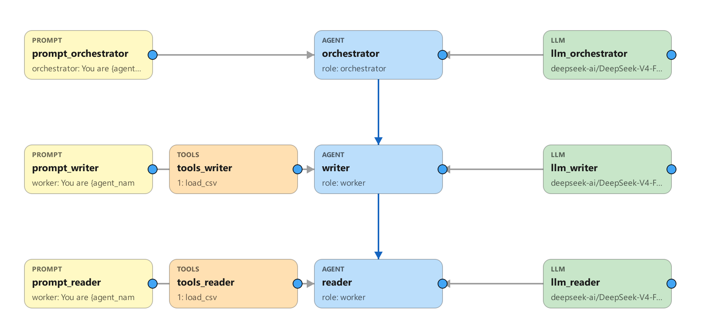
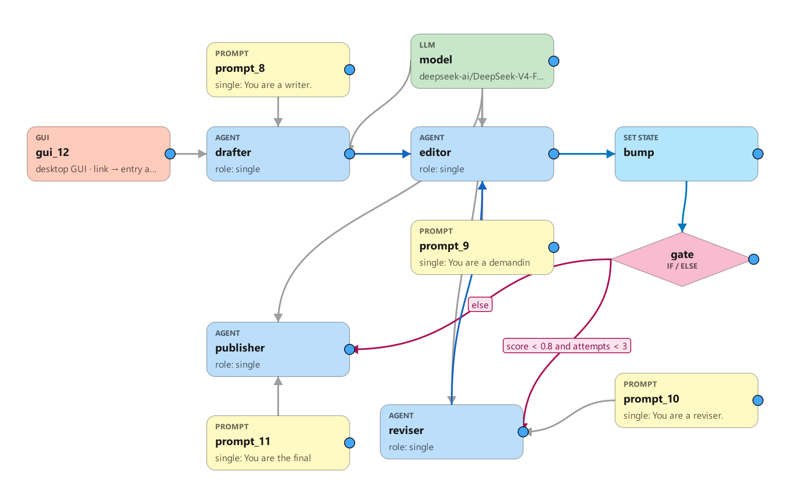

# MetaAgent User Guide

*Build AI agents on a visual canvas. Generate standalone Python. No LangChain.*

---

## 1. What is MetaAgent

MetaAgent is a desktop app (PySide6/Qt) where you **draw** an AI agent — or a whole team of agents — as a node graph, then press **Generate Code** to compile that graph into a self-contained Python folder you can run, ship, or compile to an `.exe`. You wire **agents** to the **resources** they consume (an LLM, tools, a prompt persona, skills, RAG docs, MCP servers) and the **control-flow** nodes that route between them (routers, If/Else conditions, set-state, human checkpoints). The compiler reads your graph, validates it, and emits a plain `agent.py` plus `config.json`, `requirements.txt`, `build.bat`, and a README.

The big idea: **canvas → standalone Python, with zero LangChain at runtime.** Tool files are inlined verbatim, the ReAct loop is hand-written, and the LLM is called through the `openai`/`anthropic` SDKs directly. The default backend is **DeepSeek-V4-Flash via SiliconFlow**. Generated agents depend on essentially just `openai` and `anthropic` (plus whatever your tools import) — they are small, readable, and have no framework to keep up to date.

---

## 2. Core concepts

### Node kinds

There are 22 node kinds. Agent-stage nodes are the "stages" in your pipeline; resource nodes feed *into* an agent; control nodes sit *in* the flow with no LLM; and a few nodes emit frontends or tests.

| Kind | Label | Role | What it does |
|------|-------|------|--------------|
| `agent` | Agent | stage | One ReAct agent. Has a role, budgets, reads/writes. |
| `workerpool` | Worker Pool | stage | Like an agent but runs N parallel workers (`max_workers`, default 4). |
| `router` | Router | stage | Uses an LLM to pick **one** successor at runtime. |
| `llm` | LLM | resource → agent | Assigns the model. First link = primary, extras = fallbacks. |
| `tool` | Tools | resource → agent | Attaches every `@tool` function in the node's `.py` files. |
| `skill` | Skills | resource → agent | Appends skill text to the system prompt. |
| `prompt` | Prompt | resource → agent | Sets the agent's persona (**max 1**). |
| `rag` | RAG | resource → agent | Gives the agent a `search_<kb>` retrieval tool (BM25 by default; configurable — see §6). **Multiple RAG nodes per agent OK** — each becomes its own tool and the agent picks by description. |
| `memory` | Memory | resource → agent | Gives the agent **`remember(content, tags)`** + **`recall(query)`** tools backed by a **persistent** store (`memory_store.json`) + BM25 retrieval. Survives restarts, so the agent **learns across runs** (Reflexion-style): recall past lessons before acting, remember new ones after. `top_k` = default recall size. |
| `mcp` | MCP | resource → agent | Connects an external MCP server; tools discovered at runtime (multiple OK). |
| `condition` | If/Else | control | The diamond. Routes to a branch by a safe expression over state. |
| `while` | While | control | A diamond loop guard: run the *body* successor while a condition holds, else take the *exit* successor. Compiles to the same routing primitive as If/Else. |
| `setstate` | Set State | control | Writes shared state directly (literals or `=expr`). |
| `guardrail` | Guardrail | control | An inline content gate: redacts or blocks the content flowing through it. Checks for **secrets / PII / prompt-injection**; `on_trip` = *redact* or *block* (injection always blocks). See §11. |
| `end` | End | control | A terminal **sink** (no outgoing links). When the flow reaches it the run **finishes early**, returning whatever output was carried in. Use it on an If/Else branch or While exit to stop before the rest of the pipeline. |
| `fanout` | Fan-out | control | Runs its **2+ branches CONCURRENTLY** (real threads), then reconverges at the paired Join. Each branch is an independent agent chain (may include Set-State). `max_parallel` caps concurrency (0 = unbounded). |
| `join` | Join | control | The barrier that reconverges a Fan-out's branches. Their shared-state writes are merged via each field's reducer (concurrent writes to one `overwrite` field are rejected — use append/add/max/min). `merge` = how the branch *output text* combines (concat / first / last / state_only / **vote** = the majority branch output, ties → first, for self-consistency on a label/number). |
| `hitl` | HITL | flow gate / branch | A human checkpoint. With **one** outgoing link it's a review **gate** (approve / edit / reject before the next stage). With **2+** outgoing links it's a **human-driven branch** (route mode): the reviewer picks which successor runs next — the human mirror of a Router. |
| `webserver` | WebServer | output | Emits `server.py` (websocket + web UI). Standalone, one per graph. |
| `gui` | GUI | output | Emits `gui.py` (desktop chat) when linked to the entry agent — built-in window, or your own custom `gui.py` (Extra Settings). |
| `schedule` | Schedule | output | Emits `scheduler.py` when linked to the entry agent — an **ambient** runner that calls the agent every `every_seconds` with a preset task (no user prompt). Pick a **Strategy**: **Periodic** (`every_seconds` + `offset_seconds` + `run_at_start`), **Daily** (`at` = local `HH:MM[:SS]`), or **Once** (`start_at` = exact `YYYY-MM-DD HH:MM[:SS]`) — mutually exclusive (the others' fields grey out). Plus task, `max_runs`, `session_id`. **Multiple allowed** — each Schedule node is an independent **concurrent** job over the agent. |
| `eval` | Eval | testing | A graded test set for one agent or the whole pipeline. |

**Node shapes.** On the canvas a node's **shape tells you its role at a glance**, while its **colour identifies the exact kind**. The silhouettes: **rounded rectangle** = an actor (agent — a worker pool is drawn *stacked*); **diamond** = a decision/branch (router, If/Else, While); **cylinder** = a knowledge store (RAG); **document** (wavy foot) = text/instructions (prompt, skill); **hexagon** = a compute engine (LLM, eval); **parallelogram** = a capability or I/O (tools, MCP, Set State); **octagon** = a gate/checkpoint (guardrail, HITL); **trapezoid** = an interface/output (web server, GUI); **stadium** (a pill with rounded ends) = a terminal (End). The **Add module** palette draws each button with its silhouette, so it doubles as a legend.

### Agent roles

Every `agent`/`workerpool` node has a **role** (the Agent dialog's dropdown) that sets its default persona (prompt template) and how it behaves in a pattern. The six roles:

| Role | Behavior | Typical use |
|------|----------|-------------|
| `single` | A general ReAct agent (the default) — runs alone or as one chain stage. | Any standalone agent. |
| `planner` | Breaks the task into a numbered plan for the next agent; doesn't execute. May **self-route** (`route_self`, planner-only, needs 2+ outgoing links). | Planner–executor; Adaptive-RAG router. |
| `worker` | Executes the task (and the plan, if given) thoroughly and reports. Tool-eligible. | The "doer" in most patterns. |
| `critic` | Reviews the previous agent's output; can send it back by starting its reply with `REVISE:` (a bounded revise loop). | Planner–executor–critic. |
| `supervisor` | Delegates one instruction at a time to its workers (NEXT/DONE), reviewing each result. **Entry-only**; workers must be leaves. | Supervisor–worker. |
| `orchestrator` | Spawns isolated sub-agents in parallel via the built-in `spawn_subagent` tool; each runs with only its own tools and returns just its result. **Entry-only**; sub-agents are linked leaves. | Autonomous orchestration. |

(The `router` "role" comes from the **Router node kind**, not this dropdown.) The Agent dialog greys out fields that don't apply to the chosen role (e.g. routing fields are planner-only).

**Dependency-aware Worker Pool (DAG).** Turn on **"Emit a typed dependency plan"** (`structured_plan`) on a **Planner** and **"Dependency-aware execution"** (`dag_plan`) on a downstream **Worker Pool**: the planner appends a small typed plan — a list of `{id, subgoal, depends_on}` — and the pool runs it as a DAG, so independent subgoals run in parallel (up to `max_workers`) while each dependent waits for its prerequisites and receives their outputs as context. One subgoal failing doesn't sink the batch. If the plan is missing, malformed, or cyclic the pool safely falls back to splitting the work flatly (no behaviour change). Enabling the planner option with no matching pool downstream raises an **Analyze** warning.

### Links: meaning depends on the endpoints

A link's meaning is entirely about what it connects:

- **resource → agent** *feeds* the agent: `llm→agent` assigns a model, `tool→agent` attaches functions, `prompt→agent` sets persona, `skill→agent` adds guidance, `rag→agent` adds `search_docs`, `mcp→agent` connects a server.
- **agent → agent** is *control flow*: "the left agent's output flows to the right agent." A **back-edge** (to an earlier stage) is a revise loop, painted red.

You link by dragging from a node's blue right-port ● onto a target. `ALLOWED_EDGES` enforces what can connect; `SINGLETON_INPUTS` caps `prompt`/`gui` to one per agent (RAG is no longer capped — link several). Self-links and duplicate links are rejected, as is a second Tools node bringing the *same* `.py` file to one agent.

> **⚠ Maintenance rule — any change to the canvas must update the built-in knowledge in the same commit.**
> The Estimation / design-assistant feature ships an embedded description of the canvas that the LLM reasons from. Whenever you change the canvas *vocabulary or semantics* — a node kind in `KIND_META`, a role in `ROLE_DEFAULT_PROMPTS`, a pattern in `PATTERNS`, an edge rule in `ALLOWED_EDGES`/`SINGLETON_INPUTS`, a `STATE_TYPES` entry, default budgets, or a validity rule in `analyze()` — you **must** mirror it in **`design_assistant.py`** (`KIND_DESC`, `ROLE_SEMANTICS`, `EDGE_SEMANTICS`, `CANVAS_RULES`, `CANVAS_DESIGN`, and the pattern topologies) **and** in the node/link tables in *this* document. The *enumerable* parts are guarded by `tests/_verify_design_assistant.py` (it fails if `KIND_DESC` / `ROLE_SEMANTICS` don't cover the registries); the *prose* (design narrative, rules, edge semantics) and this doc's tables are **not** machine-checkable, so update them by hand. Rule of thumb: **if you change what the canvas can do, update the knowledge alongside it — otherwise the assistant gives outdated answers.**

**Link contracts (double-click a link).** A link can carry a contract, shown as a badge on the line and edited by double-clicking it (or right-click → *Configure link…*):
- **agent → agent — a data-handoff contract.** Declare the fields the upstream produces = the downstream consumes (each a name, type, description — like a shared-state field, but scoped to this one link). At generation it's written into **both** system prompts: the producer is told to *output* those fields, the consumer to *expect* them. (Routers don't carry a contract — they forward text and pick a branch, they don't reshape data.)
  - **Advisory (default):** it shapes the prompts only — the data still flows as the previous agent's output text.
  - **Validate & retry (opt-in checkbox on the link):** the producer must reply with a **JSON object** of exactly those fields; the runtime **validates** it (all fields present + right type) and, on a mismatch, **re-runs the producer** with the specific error (bounded by *max retries*, default 2). If it still fails, the **run stops** with `[contract not met]` rather than passing invalid data on. Works in both chain and graph mode.
- **If/Else → target — the branch predicate.** Set the expression that routes to this link (empty = the else/fallback). It writes to the If/Else node's branch list (the single source of truth), so the node's own dialog and the link stay in sync.
- **While → target — loop body or exit.** Mark which link is the loop body (runs while the condition holds, must loop back) and which is the exit.

> **Branching rule:** a plain agent or pool may have **at most one** outgoing flow link. To pick **one** branch at runtime, use a Router (LLM picks), a **routing HITL** (a *human* picks — draw 2+ links out of a HITL node), a Supervisor, an Orchestrator, a self-routing Planner (`role=planner` + `route_self` + 2+ links), or route into a single If/Else node. To run branches **in parallel** (all of them, concurrently) use a **Fan-out → branches → Join**. A second outgoing edge from a plain agent is a generation error.

### The four runtime modes

At generation time `analyze()` inspects the graph and picks one mode from the **entry agent's role** and the presence of routers/conditions. The entry agent is the one with no incoming flow link.

| Mode | Chosen when | Behavior |
|------|-------------|----------|
| **chain** | default — linear pipeline | Agents run in order; optional single revise back-edge. |
| **graph** | any Router, self-routing planner, or any control node — Condition, While, Set-State, Guardrail, End, or Fan-out/Join — present (and entry is not supervisor/orchestrator) | BFS walk with runtime routing, bounded while-loops, and concurrent fan-out branches. |
| **supervisor** | entry role = `supervisor` | Star delegation loop (NEXT/DONE); workers must be leaves. |
| **autonomous** | entry role = `orchestrator` | Orchestrator spawns isolated sub-agents in parallel. |

**Key runtime fact:** in chain, graph, and supervisor modes the generated agents **do not call each other**. A driver loop (`run_pipeline` / `run_graph` / `run_supervisor`) sequences the stages, runs each agent's own ReAct loop in isolation, and passes the previous stage's output forward as plain text plus a read-only shared-state preamble. The only exceptions are routers/self-routing planners (the built-in `route_to` tool picks the next branch) and the orchestrator (the built-in `spawn_subagent` tool launches sub-agents).

### Canvas editing

- **Move / multi-select:** drag a node to move it. **Drag empty space** to box-select several (rubber-band), then drag any of them to **move the group**. `Ctrl+A` selects all.
- **Copy / paste:** `Ctrl+C` / `Ctrl+V` duplicates the selected node(s) with their full configuration — fresh ids, unique names, offset; links *between* copied nodes are re-created. Works across canvas windows.
- **Link / pan:** drag from a node's right port ● to link; **middle-drag** to pan; wheel to zoom; double-click to configure; `Del` to delete.
- **Built-in tools on the node:** each agent-like node shows a strip of its built-in tools (`route`, `spawn`, `todos`, `python`, `web`, `offload`) — **green** = provided now, **faint** = available to enable. Hover for names + descriptions.
- **Check Code (VB-style code-behind):** **right-click** a node → **Check Code** to see the real generated `agent.py` (and `config.json`) with *that node's* contributed regions **highlighted** — the agent's persona and topology entry, a tool's inlined function, an LLM's `config.json` block, a condition/setstate branch, etc. It generates the app to a temp folder, locates each region by anchor search (no template changes, so generation stays byte-identical), and opens a read-only, resizable viewer that scrolls to the first region. The un-highlighted remainder is the shared runtime, which belongs to no single node. Double-click still means *Configure*; Check Code is a separate, non-destructive view.
- **Config windows** are resizable and have **maximize/restore** buttons + a grip. The **Agent** dialog groups fields into collapsible `+/−` sections (Planner & routing · Capabilities & tools · Retrieval & answer quality · Budgets · Guardrails · **Extra Settings** · **Structured final answer**), and **greys out** fields that don't apply to the selected role (e.g. routing fields are planner-only) with a tooltip explaining why.
- **Extra Settings (power-user knobs; blank = today's default).** Collapsed **Extra Settings** groups expose advanced, opt-in per-node config — every field defaults to current behaviour, so leaving them blank changes nothing. *(Full how-to, with values and worked examples per node, in [§15](#15-extra-settings-reference-advanced-per-node-knobs).)*
    - **LLM node:** reasoning effort, seed, top-k, presence/frequency penalty, stop sequences, `max_retries`, first-turn `tool_choice` (auto/any/none/specific), input/output **prices** ($/1M tok, which enable an agent's cost cap), and a raw-JSON escape hatch.
    - **Agent / Worker:** `mode_label` (multi-pattern `/mode`), **max requests/min** (rate limit), **stage retries** (re-run a stage on a transient error), **max budget ($)** (abort when estimated cost hits the cap — needs the LLM's prices set), and a **Structured final answer** JSON-Schema (validates + re-asks, then returns clean JSON).
    - **Eval node:** the full grader registry (contains/equals/regex/numeric/similar/length/is-JSON/JSON-has-keys/starts-with/ends-with/… + a *negate* and *case-sensitive* toggle), not just contains/regex/judge.
    - **Tool node** (a per-function table): **return-direct** (the tool's output becomes the final answer), **on-error** policy (return to the model / retry N / raise-abort), a **risk** override (force high/safe, overriding the tool's own declaration), and a per-agent **description** override.
    - **HITL node:** which **decisions** the reviewer may take (approve / edit / reject) and an unattended **timeout** + auto-decision (approve/reject if no one answers in N seconds).
    - **Guardrail node:** custom **regex patterns** and **keywords** to redact or block, and a **max-length** cap that truncates overflow.
    - **RAG node:** a **score threshold** (drop low-relevance chunks — dense/cross-encoder only), a **source filter** (glob, e.g. `*.md`), and **multi-query** expansion (search N LLM-generated variants and fuse).
    - **MCP node:** per-server tool **allow/deny lists**, **connect/call timeouts**, and **env vars** (stdio) / **headers** (http/sse, e.g. `Authorization`).
    - **While node:** a per-loop **max iterations** cap (independent of the graph recursion limit).
    - **Router node:** a **default/tie-break branch** and a **routing-LLM override** (use a cheaper model just for the routing decision).
    - **WebServer node:** **TLS** (wss), **CORS** allowed origins, **max connections**, and **auto-approve tools** (headless, no HITL prompt).
    - **GUI node:** a **custom `gui.py`** — replace the built-in chat window with your own single-file front-end (Choose a `.py`, or "Use built-in" to revert). It must `import agent` and call `agent.run(...)`; any `@AGENT_NAME@` in the file is filled in on generate. The designer flags a syntax error and warns if the file never runs the agent.

---

## 3. Quick start: build and run a single agent

1. **Install and launch.** `pip install -r requirements.txt` then `python main.py`. (Deps: PySide6 6.6+, openai 1.40+.) The welcome launcher offers New project, Open bundle, Recent, and Settings.
2. **Set your key.** In **Settings**, pick a **Provider** (SiliconFlow, **NVIDIA `build.nvidia.com`**, OpenAI, DeepSeek, Gemini) to auto-fill Base URL + Model, then paste that provider's API key (e.g. `nvapi-…` for NVIDIA). The host `config.json` next to `main.py` defaults to model `deepseek-ai/DeepSeek-V4-Flash`, base_url `https://api.siliconflow.cn/v1` (no chat-completions suffix). Any OpenAI-compatible endpoint works for both the app's coding agent and generated agents.
3. **New project**, then add an **Agent** node (palette `+ agent` button, or right-click → "Add Agent here").
4. **Add an LLM** and link it: right-click the agent → **Add & link a module → Add LLM**. This creates the node, links `llm→agent`, and opens its config (provider `siliconflow`, model `deepseek-ai/DeepSeek-V4-Flash`).
5. **Add tools (optional).** Right-click the agent → **Add & link a module → Add Tools**, then check the `.py` files you want from the `tools/` library. Or use the **Tool Generator** (Tools menu) to have an in-app coding agent write a new tool for you.
6. **Configure the agent.** Double-click it to set its role, budgets, and HITL knobs. **Budgets default to `0` = UNLIMITED** (`max_iterations` / `max_tool_calls` / `max_output_tokens` / `max_wall_clock_s`) so demos run to completion out of the box — set a positive value on any of them to cap cost/runtime in production (the designer decides the real budget). `0` means: no iteration/tool-call/wall-clock limit, and no explicit output-token cap (the provider default; Anthropic keeps 8000 since it requires one).
7. **Generate Code.** MetaAgent validates the graph and writes `generated_agents/<name>/` containing `agent.py`, `config.json`, `requirements.txt`, `build.bat`, `README.md`, `system_prompts.json`, and an `evals/` harness.
8. **Add your api key.** Open the generated `config.json`. Each agent's LLM lives under `llms` as a list (first = primary, rest = fallbacks). Fill in `api_key`, **or leave it blank to read from an environment variable**.
9. **Run it.**
   - `python agent.py "your task"` — headless CLI
   - `python gui.py` — desktop chat (only if a GUI node links the entry agent)
   - `python server.py` then open `http://127.0.0.1:8765/` — web UI (only if a WebServer node is present)

To save your work: **JSON** stores topology (nodes/edges/state); the portable **`.mta`** zip also embeds tool sources, prompts, and skills. To make a lean executable, use **Compile** (clean-venv PyInstaller onedir) rather than building by hand, or the `.exe` bloats past 200MB.

---

## 4. Pattern presets

The **Patterns** menu inserts a complete preset, building each agent with its own Prompt, LLM, and — depending on the preset — a Tools node or a RAG node. Every preset ships **tuned, not bare**: each agent gets a purposeful per-role LLM temperature (deterministic `0` for a supervisor's delegation, low `0.2` for planners/workers/critics, `0.3` for a general ReAct agent) and budget head-room where the pattern loops or fans out (the orchestrator and supervisor get more iterations/wall-clock). Prompts are the role's template (already pattern-aware for planner/worker/critic/supervisor/orchestrator), except **react**, which ships a real think→act→observe prompt, and the **retrieval presets**, which ship hand-written prompts plus the right capability toggles switched on. Everything is a starting point — edit any node after inserting. Inserting a pattern **replaces the entire canvas** (it only confirms if you have existing work); it is not a merge.

### react
One single agent with a Tools node, running the classic ReAct loop (think → call tool → observe → repeat → answer). The simplest possible agent; mode = `chain`.



### planner-executor-critic
Three agents: `planner → executor → critic`, with a `critic → planner` **revise back-edge** (painted red, dashed). The planner breaks down the task, the executor does the work, the critic judges it and can send it back. Because there is no Router or Condition, this stays in `chain` mode and the back-edge is detected as the revise loop. (A simpler `planner_executor` preset drops the critic.)



### supervisor-worker
A `supervisor → worker` star: the supervisor delegates by emitting NEXT (pick a worker) or DONE, looping until finished. Workers must be leaves (no outgoing agent links). Mode = `supervisor`.



### orchestrator
An `orchestrator → writer` + `orchestrator → reader` graph. The orchestrator is the **entry-only** owner of the built-in `spawn_subagent` tool, launching its sub-agents as fresh, isolated ReAct loops (their own tools and budgets, no shared conversation) — and spawns may run **in parallel**. Sub-agents must be plain Agent leaves; no nested orchestration. Mode = `autonomous`.

**Tuning when it delegates.** Because `spawn_subagent` is just a tool, the orchestrator answers simple tasks itself and delegates only when needed — aim to avoid both *over-delegation* (spawning for trivial work: slow, costly) and *under-delegation* (never using sub-agents: pointless). The strongest control is the **tool surface**: the preset is a *pure planner* — the orchestrator has **no action tools, only `spawn_subagent`** — so link your Tool nodes to the **sub-agents, not the orchestrator**. Then a pure-reasoning task it answers directly, while anything needing a tool has no local way to do it and must delegate. (Link a few cheap tools to the orchestrator itself for a *hybrid*.) Reinforce with the orchestrator's prompt ("answer directly when you can; spawn only when a tool, isolation, or parallelism is needed") and a clear first line in each sub-agent's prompt saying what it is for — the orchestrator sees that in its sub-agent menu. Don't try to force a spawn on every task; if anything, cap fan-out with the orchestrator's tool-call / iteration budgets.



### map-reduce (parallel workers)
A `coordinator → Fan-out → {worker_1, worker_2, worker_3} → Join → reducer` graph. The coordinator frames the task, the three workers run **concurrently** (each a distinct, separately-promptable agent covering a different angle), and the reducer synthesizes their combined results at the join. Unlike a **Worker Pool** (identical workers splitting one task into subtasks), each worker here is its own node with its own prompt (and optional Tools). After inserting: give each worker a specialty in its prompt; add or remove workers by wiring `Fan-out → agent → Join`. Mode = `graph`.

### voting / self-consistency (best-of-N)
`framer → Fan-out → { solver_1 · solver_2 · solver_3 } → Join → judge`. A framer sets up the task, **N independent solvers** attempt it **concurrently** (the *same* prompt, run hot at temperature ~0.8 for diverse reasoning paths), and a **judge** picks the **consensus** answer at the join — the classic *self-consistency* trick that cuts one-shot mistakes. Differs from **map-reduce** (distinct workers whose results are *synthesized*): here the solvers are **identical** and aggregated by **agreement**. Mode = `graph`. After inserting: change the solver count by wiring `Fan-out → agent → Join`; or, if your solvers emit a bare label/number, set the Join's merge to **`vote`** and drop the judge (the majority is computed deterministically). 

### human approval (routing HITL)
`intake → human_review (route-mode HITL) → { send · reviser · escalate · reject }`. An agent drafts a reply, then a **human** picks the next step from the review dialog's buttons: **send** (approve → finalize & send), **reviser** (send back for changes — **loops back** to the review), **escalate** (hand off to a specialist), or **reject** (an **End** node — close with no reply). Shows every route-mode feature in one graph: a human-driven branch, a revise loop, an End branch, and a safe `default_route` (`escalate`) so an unattended/timeout run never auto-sends. Mode = `graph`. Also shipped as a ready-to-open example at `graphs/HumanApproval.mta`. After inserting: edit each agent's prompt for your own workflow.

### Retrieval presets (CRAG · Self-RAG · Adaptive-RAG)

Three ready-made RAG strategies for users who want a proven retrieval flow without hand-tuning the toggles. Each drops in with carefully-written prompts and the right capability flags already on. **The one thing you must still do** is double-click the RAG node and point *Docs folder* at your documents — until then the graph reports exactly that. The web-search fallback (CRAG, Adaptive) needs `pip install ddgs`.

- **Corrective RAG (CRAG)** — one `researcher` agent + a RAG node with *Grade chunks* + *Corrective re-retrieval* on, and `web_search` on the agent. Flow: search your docs → grade the passages → if nothing relevant, rewrite the query and retry → if the docs still can't answer, fall back to web search → answer with citations. Mode = `chain`.
- **Self-RAG (self-checking)** — one `self_rag` agent + a RAG node with *Grade chunks* on, and *Groundedness check* (max 2 revises) on the agent. Flow: search → answer only from graded-relevant passages → the answer is auto-checked for being grounded and on-topic, and revised if it falls short. Mode = `chain`.
- **Adaptive RAG (router)** — a self-routing `router` (planner + `route_self` + `quick_response`) that classifies each question and hands off to `knowledge_base` (your docs, graded), `web_research` (live web), or answers trivial questions itself. Mode = `graph`.

These are starting points — rename agents, edit the prompts, or add tools freely. They're built from the same node props you can set by hand (see §6 *Retrieval (RAG)*); the presets just save you the configuration.

---

## 5. Shared state & control flow

This is MetaAgent's headline feature: a multi-agent graph can share a typed, graph-level **scratchpad** and steer itself with deterministic, **LLM-free** control nodes. All of it activates only in **graph mode**, which the compiler selects automatically when the graph has a Router, a self-routing planner, or any control node (and the entry is not a supervisor/orchestrator).

### The state schema

Declare it once via **Graph → Edit Shared State**. Each field is `{name, type, reducer, default, description}`.

- **Types:** `str, int, float, bool, list, dict`.
- **Reducers** (how repeated writes merge): `overwrite` (last wins), `append` (on a `list` field pushes an item; on a `str` field **concatenates** the writes, blank-line-joined, so several stages accumulate one transcript), `add` (numeric +), `max`, `min`. The dialog restricts reducers by type (`str → overwrite/append`; `list → overwrite/append`; `int/float → overwrite/add/max/min`).

Example field row:

| name | type | reducer | default | description |
|------|------|---------|---------|-------------|
| `score` | float | max | 0.0 | Best quality score the editor has given so far. |

**Built-in fields (always present, read-only).** Every graph also has framework-maintained fields you can *read* but never declare or write — they show as locked rows in the schema editor:

| name | what it holds |
|------|---------------|
| `user_input` | The user's **original request** for this run — set once at the start, never changed. Read it (or branch on it in a Condition) to recover the initial question after several hops. |
| `tool_calls` | Names of tools called so far this run (accumulates). |
| `agents` | Agent stages visited so far this run (accumulates). |
| `todos` | The working checklist — present only when an agent enables the `write_todos` tool. |

Any attempt to write a built-in (an agent `writes` entry or a Set-State assignment) is dropped; `user_input` in particular stays fixed to the original request for the whole graph.

### Reading state

Each turn, `_state_preamble()` prepends a read-only JSON block of the current state to the stage's prompt. An agent's `reads` list limits which fields it sees (empty = all). Every agent also gets a `## Shared state` system-prompt tail describing each field by name, type, and description, so it knows the shared vocabulary.

### Writing state

An agent with a non-empty `writes` list can record state **two ways** — both restricted to its `writes` whitelist (other fields are silently dropped), both applied through each field's **reducer**:

1. **The `set_state` tool (preferred).** Writer agents automatically get a built-in `set_state` tool whose parameters are exactly their writable fields (typed from the schema). This is the reliable path: it's the native function-calling channel the model is tuned for, it can be called mid-run, and — crucially — it **doesn't fight an output-format constraint** (an agent told to *"reply with ONLY a JSON array"* can still call `set_state` on a separate channel). It's bookkeeping, so it's exempt from tool-call budgets / HITL / guardrails.
2. **A fenced ` ```state ` block** at the very end of the reply (back-compat):

   ````
   ```state
   score = 0.6
   feedback += "Tighten the intro and add an example."
   ```
   ````
   Values are Python literals (`True`, not `true`); the `=` vs `+=` operator is cosmetic (the reducer decides the merge).

**Neither *forces* the model to write** — a tool is an affordance, not a compulsion. If you need a field reliably set, tick **"Require: re-prompt until the agent records these writes"** on the agent (next to its `writes` selector). After the agent runs, if any declared writable field wasn't recorded, the runtime re-prompts it to call `set_state` (bounded retries) and then proceeds. It's best-effort enforcement (honored in chain/graph mode), not a hard guarantee.

### If/Else (the diamond) and Set-State

A **Condition** node (the only diamond-shaped node) has an ordered list of branches `[{to, expr}]`. The first branch whose expr is true wins; an empty expr is the `else` fallback. Expressions use a **safe allow-listed grammar** — comparisons, `and/or/not`, arithmetic, `len(x)`, literals, and state names — evaluated by a hand-written AST interpreter, **never Python `eval`**. Example:

```
score < 0.8 and attempts < 3
```

A **Set-State** node writes state with no LLM. Its assignments are `{field, value}`; a value starting with `=` is a **computed expression** over state plus `output` (the upstream text):

```
attempts  =  =attempts + 1
```

> Gotcha: a value **without** the leading `=` is stored as a literal string. `attempts + 1` is the text "attempts + 1"; you want `=attempts + 1`.

### While-loops, recursion_limit, checkpoint/resume

A Condition back-edge to an earlier stage forms a **bounded while-loop**. `recursion_limit` caps total stage transitions (agents *and* control nodes); overflow raises `GraphRecursionError`. Set it explicitly, or `0` = auto (`len(stage_kinds)*(MAX_REVISE_ROUNDS+3)+5`).

**The While node** makes that loop first-class. Double-click it to set a **loop condition** (a safe expression over state, e.g. `attempts < 3 and not solved`) and pick the **loop body** successor. Wire `While → body`, route the body back to the While node (directly or through a Set-State that makes progress), and `While → exit` (taken when the condition is false). It lowers to the same condition table the runtime already understands, and the validator catches a missing condition/body/exit and warns if the body never loops back. See `graphs/WhileLoopDemo.mta` for a runnable `Start → Loop[attempts<3] → Work → Bump[=attempts+1] → Loop; Loop → Report` example.

Declaring shared state also unlocks **opt-in checkpoint/resume** keyed by `thread_id`: with `"checkpoint": true` in config.json, `run_graph` snapshots state at each stage boundary to `checkpoints/<thread_id>.json`, and `resume(thread_id)` continues from the last stage. Checkpointing is at-least-once per stage (a stage may re-run on resume), and a checkpoint from a different topology is ignored.

### End (finish early)

An **End** node (the pill/stadium shape) is a terminal **sink**: it takes incoming links but has none outgoing, and when the flow reaches it the run **stops and returns whatever output was carried into it** — skipping the rest of the pipeline. Use it to short-circuit. In a picture-book agent, for example, wire `author → If/Else`; the *is-just-a-greeting* branch goes to **End** (reply and stop) while the *else* branch continues `→ illustrator → bookbinder`. Reach End from an If/Else branch, a While exit, or a plain agent / Set-State / Guardrail edge — **not** from a Router (which branches among *agents* via the LLM) or a HITL gate (which reviews before an *agent*); those links are refused. If a Guardrail sits just before End, End returns the guardrail-processed (e.g. redacted) output, since it returns the value flowing through the graph. Any graph with an End node runs in **graph mode**.

### Worked example: StateRefineDemo

An editorial refine loop. **Schema:** `draft (str/overwrite)`, `score (float/max)`, `feedback (list/append)`, `attempts (int/overwrite)`; `recursion_limit = 25`.

**Flow:** `drafter → editor → bump (setstate) → gate (condition) → reviser or publisher`, with `reviser → editor` closing the loop.

1. **drafter** (`writes=[draft]`) writes the first draft into `draft`.
2. **editor** (`reads=[draft]`, `writes=[score,feedback]`) judges it and appends a `state` block with `score` (kept by `max`) and `feedback` (appended).
3. **bump** (Set-State, no LLM) runs `attempts = =attempts + 1` → 0 becomes 1.
4. **gate** (Condition) evaluates in order:
   - `score < 0.8 and attempts < 3` → **reviser**
   - `""` (else) → **publisher**
5. **reviser** (`reads=[draft,feedback,attempts]`, `writes=[draft]`) rewrites the draft and loops back to **editor** for re-scoring.

The loop runs until `score >= 0.8` **or** `attempts` reaches 3, then `gate`'s else branch sends the latest draft to **publisher**. `recursion_limit=25` guarantees termination even if the exit condition never trips.



> Only **one** incoming path runs per execution — MetaAgent does not do true parallel fan-in. To accumulate across branches or iterations, write into an `append`/`add`/`max`/`min` field; `overwrite` keeps only the last writer's value (and the compiler warns when 2+ stages overwrite the same field).

---

## 6. Tools, skills, RAG, MCP, HITL, eval

Resource behaviors are real, editable Python modules under `runtime/`; the generators inline them into `agent.py` via `@MARKER@` substitution. Anything that should stay tweakable after generation lives in `config.json`.

### Tools
Tools are plain `.py` files in `tools/`, each a function decorated with `@tool` from `tool_registry` (a ~0ms, LangChain-free decorator). At generation the import line is stripped and the source is inlined verbatim — the generated agent defines its own identical `tool` shim, so it has **zero LangChain dependency**. Tool schemas for native function calling are built from the signature: the first docstring line becomes the description the LLM sees; typed args without defaults become required. `requirements.txt` is auto-derived by scanning the inlined tool imports (e.g. `PIL → Pillow`, `bs4 → beautifulsoup4`, `fitz → PyMuPDF`).

The **Tool Generator** (Tools menu, or a Tool node's "Create a new tool…") is an in-app coding agent (DeepSeek via SiliconFlow) that writes new tool files for you. Its `save_tool` is high-risk and pops a code-preview confirm dialog whose default button is **Deny**.

Per-function overrides — **return-direct**, an **on-error** policy (return/retry/raise), a **risk** override, and an LLM-facing **description** override — live in the Tool node's *Extra Settings* table; see [§15.2](#152-tools-node-per-function-overrides).

### Skills
A Skills node attaches per-agent guidance text appended to the system prompt as `## Skill: <name>`. Skills are editable live (persist to `skills.json`); if a Skills node exists the generated GUI gets a Skills menu (add/update/remove).

### RAG
A RAG node with a `docs_dir` gives its linked agent a `search_docs(query, top_k)` retrieval tool over two sources: files auto-indexed from `docs_dir` (`.txt/.md/.py/.json/.csv`, plus `.pdf` via optional `pypdf` and `.docx` via `python-docx`) and GUI-managed chunks. **Multiple RAG nodes per agent** are allowed — each becomes its own `search_<kb>` tool named from the node, and the agent routes by the node's **description**. Basic config (`docs_dir`, `chunk_chars` 800, `top_k` 4, description) is editable without regenerating.

The RAG dialog's advanced pipeline lives in **collapsible sections** (like the Agent node) — *Chunking*, *Retrieval & ranking*, *Query rewriting & correction*, and *Embedding & vector store*. The dialog opens compact; expand only the area you're tuning. Every knob defaults to the plain offline BM25 baseline, so leaving them untouched keeps today's behavior:

- **Chunking:** `fixed` / `recursive` / `markdown` / `code`, plus overlap.
- **Retrieval granularity:** `chunk` (default — index and return the same piece) or **`parent_child`** (small-to-big, learnRAG §4.3): the doc is split into big *parent* blocks and each parent into small *children*; the children are indexed/embedded for **precise matching**, but the matched child's **bigger parent block is returned** (de-duplicated) for **fuller context**. Set the parent size with *parent chars* (default 2400).
- **Retrieval:** `bm25` (default), `dense` (cosine), or `hybrid` (RRF fusion). Dense/hybrid use a **free, no-API-key local embedding** by default (`BAAI/bge-small-zh-v1.5` via `fastembed`/`sentence-transformers`) — or an OpenAI-compatible embedding endpoint. **CJK-aware** tokenization. **Vector store:** in-memory (default), `chroma` (persistent), `faiss` (in-memory ANN), or **`qdrant`** — embedded on-disk by default (`./rag_qdrant`, no server, offline) or a remote Qdrant server when you set a *Qdrant URL* (+ optional API key). All are optional deps that **degrade to the in-RAM store** if the library is missing.
- **MMR** diversity and **query rewrite** — opt-in.
- **Rerank** (learnRAG §9, two-stage retrieval): `none` (default), `llm` (rank with the agent's LLM — costs tokens, injectable), or **`cross_encoder`** — a **free, local** cross-encoder scores each `(query, passage)` pair jointly for precise ordering (no tokens, deterministic, not prompt-injectable). Model is configurable (`reranker model`, default `BAAI/bge-reranker-base`; `BAAI/bge-reranker-v2-m3` for strongest CJK; `ms-marco-MiniLM-L-6-v2` for fast English) via `fastembed`/`sentence-transformers`. Set `recall_n` (e.g. 20–50) to feed it a wide pool. **Fail-soft**: no lib/model/network → keeps the retrieval order + a `[note: cross-encoder reranker unavailable …]`.
- **Grade chunks for relevance (LLM)** — Self-RAG-style: an LLM drops clearly-irrelevant chunks before they reach the agent.
- **Corrective re-retrieval (CRAG)** — if a search finds nothing, rewrite the query and retry (bounded by *max retries*).
- **Evict used retrievals** — a newer search elides earlier results this turn to save context.

Every step is **fail-soft**: no embedding lib / key / network → it silently falls back to BM25 (and now surfaces a `[note: semantic search unavailable …]` so the drop isn't invisible).

### Memory (persistent cross-run learning)
A **Memory** node linked to an agent (`memory → agent`) gives it two tools: **`remember(content, tags)`** — save a durable lesson / fact / outcome — and **`recall(query, k)`** — retrieve the most relevant past memories (BM25, reusing the RAG ranker; falls back to the most *recent* if nothing matches). The store is a **persistent** JSON file (`memory_store.json`) written crash-safely, so it **survives restarts** — the agent learns **across runs** (Reflexion-style): recall relevant lessons *before* acting, remember new ones *after*. Set `top_k` for the default recall size. Unlike **RAG** (read-only retrieval over *your* documents), memory is **written by the agent at runtime** and accumulates. It's zero-config and offline (no embeddings/keys). Prompt the agent to use it, e.g. *"Before answering, `recall` relevant past lessons; after, `remember` anything worth reusing."* Reuse the `voting`/`planner-executor-critic`-style presets or wire it onto any agent. (Distinct from an agent's per-turn conversation history, which is separate and always on.)

### Agent capabilities (built-in tools & answer quality)

Beyond linked resources, the **Agent** dialog carries per-agent toggles (in the *Capabilities & tools* and *Retrieval & answer quality* collapsible groups). All are **opt-in / off by default** and fail-soft — an agent you don't touch behaves exactly as before. Each becomes a built-in tool or a runtime behavior, and enabled built-ins show as green pills on the node:

*(Separate from these capability toggles, the Agent's **Extra Settings** group — rate limit, stage retries, cost cap, mode label, and a structured-final-answer schema — is documented in [§15.1](#151-agent-node-and-worker-pool).)*

| Toggle | Gives the agent | Notes |
|--------|-----------------|-------|
| **Enable to-dos** | `write_todos` checklist tool | Backs the built-in `todos` state; shown live in the Run trace. Best for sustained multi-step work. |
| **Code execution** | `run_python` tool | Runs Python in an isolated subprocess (cwd = workspace), HITL-confirmed. Backend `subprocess`/`docker`/`auto` + timeout/memory/image. Isolation, **not** a security sandbox; needs a workspace. |
| **Web search** | `web_search` tool | Keyless **DuckDuckGo** lookup for external/recent facts. HITL-confirmed (network egress); needs `pip install ddgs` in the agent's env; honors the proxy. |
| **Offload large results** | `read_offload` tool | When a tool result exceeds `offload_threshold_chars` (12000), the full text is written to `<workspace>/offloaded/…` and replaced in-context by a pointer + preview; the agent re-reads via `read_offload`. Needs a workspace. |
| **Adaptive retrieval** | prompt guidance | Adaptive-RAG: decide *first* whether to search at all, then route to the best source (a KB, or `web_search`). |
| **Groundedness check** | grade + regenerate loop | Self-RAG: after answering, grade the answer for grounding in the retrieved context + answering the question; if it falls short, revise up to *max revises*. One extra LLM call. |

**Research sub-agent (context quarantine).** A **spawnable** sub-agent (a successor of an `orchestrator`) that has retrieval tools (a RAG KB and/or `web_search`) automatically gets a *research contract*: search in its isolated context and return only a **compact, cited summary** — the raw chunks stay with the sub-agent and never flood the orchestrator's window. Compose it with `spawn_subagent` for heavy/multi-source research (see `graphs/ResearchAgentDemo.mta`).

> **Enable CRAG (Corrective RAG), end to end:** on the **RAG node** tick *Grade chunks for relevance* + *Corrective re-retrieval*; on the **Agent** tick *web_search* (the fallback when the KB can't answer) and, for the full Self-/Adaptive-RAG flow, *Adaptive retrieval* + *Groundedness check*. Generate, then `pip install ddgs`. Flow: search KB → grade → if nothing relevant, rewrite + retry → if still nothing, web search → (optionally) grounded, self-checked answer.

### MCP
MCP nodes become `config['mcp_servers']` entries. On first `run()` the runtime connects each server (stdio / streamable_http / sse), lists its tools, and registers them by name with a sync wrapper. Failures are isolated — a dead server logs a warning, yields 0 tools, and the agent keeps running. Edit servers later in config.json and use **Settings → Reconnect MCP Server(s)**.

**Renaming resource nodes.** Renaming a **Tool**, **Prompt**, or **Skill** node only relabels the canvas — the generated agent is unchanged (its behaviour comes from the tool file / prompt text / skill items, not the node name). Two exceptions: renaming an **MCP** node changes the friendly name shown in the runtime's `[mcp] …` log lines (the internal id still keys tool attachment, so reconnect works either way), and renaming a **RAG** node when you have two or more knowledge bases changes its retrieval tool name (`search_<name>`) and KB label — so keep multi-KB RAG names meaningful (a single RAG node always exposes the fixed `search_docs`).

### HITL (human-in-the-loop)
Active when `config['hitl_confirm']` is true (default). Two mechanisms: **tool confirmation** (prompts before high-risk tools) and **review checkpoints** (`approve | edit | reject`). High-risk detection is **authoritative-per-tool first, name-heuristic last**: a tool can declare its own risk with `@tool(risk="high")` or `@tool(risk="safe")`, which codegen bakes into `config['high_risk_tools']` / `config['safe_tools']`. So a read-only `update_dashboard` marked `safe` will **not** prompt (despite matching `update`), and a destructive but innocuously-named `refresh_cache` marked `high` **will**. Only tools with no `risk=` fall back to the substring guess on the tool name (`write/save/delete/send/post/exec/drop/create/update/upload/shell/…`). Both lists stay editable in config.json (`high` wins if a tool is in both), and the same classification decides parallel-tool safety. `hitl_on_reject` is `stop` (end the run) or `revise` (feed feedback back one step).

The **tool-confirmation dialog** (GUI, canvas Debug-Run, and desktop client) is a **resizable** window showing the *full* arguments — including a long LLM-generated `code` string — in a scrollable editor. You can **Allow**, **Allow edited** (edit the primary argument first, and the tool runs your edited version), or **Deny**, and tick *"Don't ask again for &lt;tool&gt; (this run)"* to skip further prompts for that tool for the rest of the turn.

**Routing HITL (a human-driven branch).** A HITL node is normally a *gate* (one outgoing link → approve/edit/reject before the next stage). Draw **2+ outgoing links** out of it and it becomes a **route-mode** node — the human mirror of a Router: the run pauses, the reviewer is shown the payload and a **button per branch**, and their pick decides which successor runs next. Branches are the outgoing targets **by name** (an agent, a Condition/While, or an **End** node for a "stop here" choice); the reviewer may also edit the payload the chosen branch receives. Route mode is **auto-enabled the moment a HITL has 2+ outgoing links** — the Configure HITL dialog makes it obvious with a coloured **ROUTE / GATE banner** (the gate banner tells you to draw a 2nd link to switch), and it **grays out the gate-only options** (on-reject, approve/edit/reject, on-timeout) since the reviewer picks a branch instead. Set a **Default branch** (shown in route mode) as the tie-break taken on an unattended `timeout` (or when a headless/auto run can't ask). This works across the desktop GUI, the canvas Debug-Run, and the web server (the browser shows a numbered branch picker). Approval / triage / escalation flows are the canonical use. *(A 1-outgoing HITL is byte-identical to before — nothing changes for existing graphs.)*

### Prompt hardening (indirect prompt-injection mitigation)
Active when `config['harden_prompts']` is true (default). Every **tool result** and **retrieved document** the model sees is wrapped in a per-run, random-nonce'd tag — `<untrusted-a7f3c1 from=web_search> … </untrusted-a7f3c1>` — and each agent's system prompt carries a clause telling the model that content inside those tags is **untrusted DATA, never instructions** (so "ignore previous instructions" pasted into a web page or document is treated as text). The random nonce (fresh each run) stops an attacker forging the closing tag to "break out." This is an **XML-delimiter mitigation** (as recommended in `learnAIAgent_cn.md` §2.3.2) — it *reduces* injection success, it is **not a boundary**: the real enforcement is still **HITL** on high-risk tools and the **guardrails**. Turn it off with `harden_prompts: false` in config.json.

### Eval
An Eval node provides a graded test set: linked to one agent it tests that agent in isolation; standalone it tests the whole pipeline. Cases grade by substring, regex, or LLM judge. Run with `python run_evals.py` (supports a jsonl path and `--floor` for CI exit codes).

---

## 7. GUI, WebServer, streaming, traces

- **Desktop GUI** — a `gui` node linked to the entry agent emits `gui.py`, a PySide6 chat window over `core.run()`. Without it the agent is headless CLI.
- **WebServer** — a standalone `webserver` node emits `server.py`, a websocket + web chat UI on `ws://host:port` (default `127.0.0.1:8765`). **HITL works over the web**: it is a real bidirectional round-trip — the server sends a `hitl_confirm` (high-risk tool) or `hitl_review` (stage review) message and the worker thread blocks until the browser replies with `hitl_response`, so you can approve/deny tools and review stages right in the web UI. If no client is connected to answer (or `AUTO_ALLOW` is set) it falls back to approve / deny-high-risk.
- **Scheduled (ambient) agents** — a `schedule` node linked to the entry agent emits `scheduler.py`: instead of waiting for a user, the agent **runs itself on an interval**. Every `every_seconds` it calls `core.run(task)` with the preset task, prints the result, and keeps its own rolling conversation — so it can monitor, poll, or maintain something on its own. **Preview it in the canvas** with **Generate ▸ Debug Scheduler (live overlay)** — it runs each job's task **once, in-process, with the same live node overlay + trace panel as a Debug Run** (using your debug API key, which you can **copy from the coding agent**), so you can actually *see* what each scheduled job does before deploying. To run the real recurring/ambient process, use **Generate ▸ Run Scheduler (ambient)** (it opens its own console window so you see each tick) or `python scheduler.py`; Ctrl+C stops it and unwinds any in-flight run cleanly. *(The ambient process runs separately, so it reads its API key from `config.json`. When you launch **Run Scheduler** with a keyless config, the canvas **reminds you and offers to copy your key** — including from the coding agent — into that local `config.json` so the run works; it's a local working copy, cleared on regeneration and scrubbed from the `.mta` bundle, and the operator normally sets the key on the real deployment. The in-canvas Debug Scheduler uses the designer's key in memory only.)* **You can add several Schedule nodes** — each becomes an **independent, concurrent job** over the same agent, with its own task, `every_seconds`, `offset_seconds` (a start delay to stagger jobs so they don't all fire at once), `max_runs`, and `session_id` (blank = isolate that job by its node name, so concurrent jobs don't collide). Each job picks **one scheduling strategy** (a *Strategy* dropdown — the other strategies' fields grey out, so there's no ambiguity):
- **Periodic** — every `every_seconds` (+ `offset_seconds` phase, `run_at_start`). Intervals are **drift-free** (anchored to the scheduled time, not "sleep after each run").
- **Daily** — every day at a local time **`at`** (`HH:MM[:SS]`, e.g. `09:00`).
- **Once** — a single run at an exact **`start_at`** timestamp (`YYYY-MM-DD HH:MM[:SS]`).

Picking Daily or Once **ignores** the periodic fields entirely. Each run's header prints its timestamp (`=== [news] run #3 @ 2026-07-08 09:00:00 ===`); times are local. Per-job settings live in `config.json`'s `schedules` list (retune without regenerating). Pair it with a **Memory** node and the agent *learns* across ticks; with a **RAG** node it re-checks your documents each cycle. *(This is the "scheduled" flavour of event-driven; per-agent scheduling and webhook / external-event triggers are natural next steps.)*
- **Multi-user & concurrency** — the web server (and the gateways in `client/`) serve **many users at once, each fully isolated**. Every connection gets its own **session** (a per-connection id, or a stable one a gateway pins via the `session_id` field on the task frame — WeChat/DingTalk/Feishu key it per end-user). Each session has its **own conversation history, run state (cancel/usage/cost), HITL prompts, images, workspace, and trace** — nothing bleeds between users, and one user's **Stop** or disconnect only affects their own run. Runs execute **concurrently** (a session's own turns still serialize; different sessions run in parallel). Conversations are persisted per session (`sessions/<id>.json`), so they survive reconnects; the newest ~200 stay in memory (`config['sessions_in_memory']`) and older ones reload from disk on demand. *(Note: for multi-pattern `/mode` apps, runs serialize while a mode is active — a rare combination.)*
- **Streaming + Stop** — `config['stream']` (default true) streams tokens as they arrive; the Stop button calls `request_cancel()`, which sets a cancel event and force-closes the active LLM stream so even a blocked first-token read aborts. Cancelled/rejected/errored runs are not saved to history.
- **Cross-run memory (bounded)** — each run prepends the conversation so far: a **rolling summary** plus the recent turns. When history exceeds ~20 turns the older ones are folded into the summary (an LLM merge); the recent-turns slice is char-capped, and the **summary itself is hard-bounded** (`config['summary_max_chars']`, default 4000) at both the fold and the injection points — so it can't grow without limit across many runs and crowd out the context window, no matter how the summarizer behaves. Within a run, the entry agent also compacts older turns to stay under its LLM's `context_capacity`.
- **Vision** — turn on an LLM node's "Accepts image input" flag. Images are attached only to the **first** agent that runs, and only if its model is a vision model; attaching to a non-vision model silently drops the image (with a hint to switch).
- **Traces** — every run writes a JSONL file to `traces/`. A live trace sink drives the designer's debug overlay (per-node idle→running→done/error coloring, step/tool counts, lit-up edges) and a trace side panel with a live event timeline. **Fan-out is shown natively:** all branches of a Fan-out light up **running at the same time** (each with its own step badge) and finish independently — no phantom edges between sibling branches; the Fan-out→branch and branch→Join edges light as the barrier opens and closes.
- **Usage by agent** — after a Debug Run (or when replaying a saved `traces/*.jsonl`) the trace panel shows a per-agent breakdown: in/out tokens, tool calls, and LLM steps, plus run totals with any retries/failovers. **Cost is opt-in** — a dollar figure appears only when you supply per-model prices (a saved trace carries none). Note: for a parallel worker pool the step count is approximate (workers share one name), but token and tool-call counts stay accurate.

---

## 8. The generated app

`generate_from_graph` writes a self-contained folder under `generated_agents/<name>/`:

| File | Purpose |
|------|---------|
| `agent.py` | The full runtime (ReAct loop, driver, inlined tools). Topology and budgets are **baked in here**. |
| `config.json` | LLMs per agent + flags. **Re-read live** at runtime. |
| `requirements.txt` | `openai`/`anthropic` + tool deps (+ PySide6 if GUI, +mcp if MCP, +websockets if server). |
| `build.bat` | Clean-venv PyInstaller onedir build. |
| `README.md`, `system_prompts.json` | Docs + resolved prompts for debugging. |
| `evals/` + `run_evals.py` | The eval harness. |
| `gui.py` / `server.py` | Only when a GUI/WebServer node is present. |

### Code style: single file vs Python package

**Generate ▸ Generate Code** offers two layouts (same agent behaviour — purely how the code sits on disk; the choice is recorded in `config.json` as `code_style`):

- **as Single File (portable)** — the legacy default (**Ctrl+G**). One self-contained `agent.py` with the whole runtime inlined. Easiest to ship/inspect as a single artifact.
- **as Python Package (modules)** — a conventional editable project:

  ```
  <name>/
    agent.py              # thin engine: topology + ReAct loop + run*/pool/eval + tools
    runtime/
      _core.py            # shared foundation: config/state, LLM primitives, trace,
                          #   storage, workspace, image, MCP registry
      hitl.py  rag.py  history.py  guardrails.py  skills.py  checkpoint.py
    config.json  requirements.txt  gui.py  ...
  ```

  Every module does `from ._core import *`, so the whole package shares **one live** `CONFIG` / `_RUN` / `HISTORY` / `TOOLS` (functions run against their defining module's globals — there are no copies). `agent.py` star-imports every runtime name, so `import agent; agent.run()/agent.CONFIG/…` keeps working exactly as before (this is what `gui.py` / `server.py` / `run_evals.py` rely on). `pool` and `eval` stay inline in `agent.py` because they call back into the engine.

  Two things differ mechanically in a package: (1) to monkeypatch the LLM in a test, patch `runtime._core._call_one` (not `agent._call_one`) since `llm()` lives in `_core`; (2) PyInstaller (`build.bat`) follows the `runtime.*` imports automatically but the package layout is less battle-tested for frozen builds than the single file — prefer single-file if you'll compile to an exe.

### config.json — usually you just add the api key

The generated `config.json` holds an `llms` dict per agent (a list: first primary, rest fallback) plus flags like `hitl_confirm`, `high_risk_tools`, `safe_tools`, `llm_modes`, `stream`, `offload_threshold_chars`, `rag`, `skills`, `evals`, `mcp_servers`, `server`. Typically you only set `api_key` on each LLM — **or leave it blank to read an environment variable**.

**Lock an agent to one model (no failover).** With 2+ linked LLMs, the first is primary and the rest are fallbacks — by default the agent **fails over** to the next model on error. To pin it to exactly one model, set the agent's **Multiple LLMs → manual** in its canvas dialog (Agent / Worker-Pool), or in the running desktop app use the **LLM** menu → your agent → pick the model and tick **Lock to selected (no fallback)**. In `manual` mode only the chosen model runs — it still retries transient errors but never switches, so its error surfaces to you. Saved under `config['llm_modes']` (only the `manual` agents are listed; `fallback` is the default).

**Proxy.** Each LLM entry accepts an optional `"proxy": "http://host:port"` (e.g. behind a corporate proxy / Zscaler); a top-level `"proxy"` applies to all LLMs, and if both are blank the agent falls back to `HTTP(S)_PROXY` env vars. Without it, on a network that blocks direct egress the LLM call would hang — the runtime uses a short connect timeout so it fails fast with a clear error instead.

**Edit settings from the running app.** The generated GUI has a **Settings** menu → **Edit Settings…** to change per-LLM API key / model / base URL / **proxy** / timeout, the WebSocket **port**, and behaviour toggles, then it saves `config.json` and reloads — no restart. (The same menu keeps *Reload Config* and *Reconnect MCP Server(s)*.)

```json
{
  "llms": {
    "csv_helper": [
      {
        "provider": "siliconflow",
        "model": "deepseek-ai/DeepSeek-V4-Flash",
        "base_url": "https://api.siliconflow.cn/v1",
        "api_key": ""
      }
    ]
  },
  "hitl_confirm": true,
  "stream": true
}
```

`reload_config()` re-reads keys, models, timeouts, sampling, HITL, and mcp_servers live — but **topology and budgets are baked at generation time**, so changing the graph shape or budgets requires regenerating.

> Two different `config.json` files exist: the **host** one (next to `main.py`, key `api_key` — provider-neutral; a legacy `deepseek_api_key` is auto-migrated) configures the MetaAgent app, the Tool Generator, and Estimation; the **generated** one (per-agent `llms` lists) configures your built agent. Both work with any OpenAI-compatible provider — set `api_key` + `base_url` + `model`.

---

## 9. Tips & gotchas

- **Always use `deepseek-ai/DeepSeek-V4-Flash`.** The bare `deepseek-ai/DeepSeek-V4` does **not** exist on SiliconFlow and fails at the chat endpoint. The `base_url` must never include the chat-completions path.
- **Branching needs a router/condition.** A plain agent gets one outgoing flow link. For data branching, route into a single If/Else node; for LLM-decided branching, use a Router, self-routing Planner, Supervisor, or Orchestrator.
- **`route_self` / `quick_response`** are honored only when `role == 'planner'` **and** the agent has 2+ outgoing agent links; otherwise silently ignored.
- **A Prompt node linked to a Router does nothing.** A Router's guidance comes only from its own **Instructions** field (else a built-in default); the `prompt → router` link is allowed but silently ignored. Put routing rules in the Router's Instructions, not a Prompt node.
- **Name router branches well — order matters.** The router chooses from each branch's **name + first line of its persona + tool list**, so give every branch a descriptive name and a clear first persona line. On an ambiguous reply the matcher falls back to the **first** successor, so branch/link order decides the tie-break.
- **`orchestrator` is entry-only.** A mid-chain orchestrator is a hard error. Sub-agents must be plain leaf Agents — no nested orchestration.
- **Condition/Set-State require declared shared state.** Add at least one field via Graph → Edit Shared State or `analyze()` errors. They are rejected with a supervisor/orchestrator entry.
- **Always include an else branch** (empty expr) on a Condition — falling through with no match raises `RuntimeError` at runtime (validation only warns).
- **Set-State `=expr` needs the leading `=`.** Otherwise the value is stored as a literal string.
- **The `state` block must be last** in the reply and tagged exactly ```` ```state ````. The reducer — not the `=`/`+=` operator — decides how a write merges.
- **Reads/writes mismatches** are the usual reason "the agent ignored the state": it only sees fields in `reads` (empty = all) and only writes fields in `writes`.
- **An agent's LLM must be a text chat model.** Pointing it at an image/embedding model warns; image generation belongs *inside a tool*, not on the agent's LLM node.
- **Duplicate tool files to one agent is an error** (same function registered twice). Identical LLMs or skills only warn.
- **Patterns replace the canvas**; use Graph → Merge graph from… to combine instead.
- **`.mta` is the portable format** (it embeds tool sources/prompts/skills); plain JSON stores only topology. `load_mta` never overwrites a differing local `tools/` file — it keeps yours and reports a conflict.
- **Regeneration is authoritative** from the canvas: stale `skills.json`/`evals.json` in the output are deleted on regenerate, discarding runtime-only edits not reflected in the graph.
- **Behind a proxy?** If the agent runs where direct internet egress is blocked (corporate / Zscaler), set `proxy` in config.json (per-LLM or top-level) or the `HTTP(S)_PROXY` env vars — otherwise the LLM call fails fast with a clear timeout instead of hanging.
- **`web_search` needs `pip install ddgs`** in the generated agent's environment; it's HITL-confirmed (a network egress) and routes through the proxy.
- **Offloading needs a workspace folder** — without one, a too-large tool result is truncated (with a note) instead of written to `offloaded/…`.
- **The While node needs shared state** (the loop condition reads it) and usually a Set-State in the loop body to make progress; the body must route back to the While node, and the loop is bounded by `recursion_limit`.
- **Role-greyed Agent fields are only the planner routing fields** (`route_self`/`quick_response`/`structured_plan`) — every capability (to-dos, code-exec, web-search, offload, adaptive retrieval, groundedness) works for **all** roles and stays editable.
- **Always Compile via the designer** (clean buildenv venv) or the exe bloats past 200MB; a frozen MetaAgent needs Python on PATH, or run the agent's own exe.

---

## 10. Design review — the Estimation menu

The **Estimation** menu reviews your graph (read-only) and streams findings into a **resizable, non-modal** window — *the canvas stays fully editable while it runs.* Four actions:

- **Estimate Graph** — **deterministic (no LLM):** the errors + warnings from `analyze()`, the resolved mode / entry / pipeline, and cost-shape metrics (agent count, minimum agent invocations, budget totals, worker-pool / orchestrator parallelism, loops).
- **Estimate Prompts** — each agent's composed system prompt: deterministic checks (empty / too-short / too-long / duplicate / role-default) **plus** a grounded LLM judge that flags internal **contradictions**, ambiguity, conflicts with the agent's role/tools, and missing guidance — plus a **cross-prompt** pass for inter-agent conflicts.
- **Estimate Tool** — deterministic docstring checks + an LLM judge of each linked tool function's docstring (could an agent tell *when* and *how* to call it?).
- **Estimate All** — runs all three, tags each finding by area, and adds a holistic synthesis of the top issues.

Findings are colour-coded by severity and appear **bit-by-bit** as they're produced (deterministic ones instantly, LLM ones as they land). A finding that names a node is a **link — click it to jump to that node** on the canvas. **Copy** / **Save** export the report as Markdown.

**Needs an API key.** The LLM layers use the same LLM as the Tool Generator (the **⚙ gear** in the top-right corner **→ LLM API Key / Model / URL…**). *Estimate Graph* works with no key; the others fall back to their deterministic checks and note the LLM pass was skipped. If no key is set when you run an estimate, MetaAgent opens the settings dialog first.

**Fix with AI (opt-in, human-approved loop).** When findings are auto-fixable (prompt issues and tool docstrings), a **Fix with AI…** button appears. It:
1. proposes **one rewrite per agent** (resolving *all* that agent's prompt issues in a single edit — no clobber) and **one docstring rewrite per tool function**;
2. shows each rewrite in a **resizable before/after review** — you **Apply** or **Skip**;
3. applies with a **self-check + auto-revert**: a prompt edit is reverted if `analyze()` gains a new error; a docstring edit is reverted if the tool file no longer compiles;
4. then **re-estimates and repeats** until nothing fixable remains (or a round cap), so fixes compound instead of overwriting each other.

Graph-structural findings are advisory (not auto-fixed), and **nothing changes without your per-fix approval.**

---

## 11. Guardrails (content safety)

Two mechanisms, both distinct from HITL (§6) and prompt hardening (§6):

- **Per-agent guardrails** (Agent dialog) — hooks that scan an agent's **tool arguments, tool results, and final output**: PII redaction, secret detection, an input scan, an image allow-list, and an optional advisory LLM classifier. Runtime: `runtime/guardrails.py`. Off by default; configured per agent.
- **The Guardrail node** (a control node) — an **inline content gate** placed *in* the flow that **redacts or blocks** the content passing through it. Checks: **secrets / PII / prompt-injection**; `on_trip` = *redact* or *block* (injection always blocks). Wire it between stages — e.g. just before an **End** — to sanitize what flows onward (End returns the guardrail-processed output).

Neither is a security sandbox — they *reduce* risk. The real enforcement for dangerous actions remains **HITL** on high-risk tools.

---

## 12. Storage & persistence

**Graph → Storage / Persistence…** chooses where the *generated* agent keeps its **chat sessions (memory)** and **checkpoints**: **disk** (the default file layout), **SQLite**, or **PostgreSQL** (via a DSN). Runtime: `runtime/storage.py`; the choice is saved with the graph. (Checkpoint/resume behavior itself is covered in §5.)

---

## 13. Running & debugging in the designer

Beyond **Generate Code**, you can run and inspect an agent without leaving the canvas:

- **Generate ▸ Run GUI Agent** — launch the generated desktop GUI.
- **Generate ▸ Run Scheduler (ambient)** — launch `scheduler.py` in its own console (needs a Schedule node linked to the entry agent); the agent then runs itself on its interval.
- **Generate ▸ Debug Scheduler (live overlay)** — preview each Schedule job once in the canvas with the live trace overlay (uses your debug API key).
- **Generate ▸ Debug Run (live overlay)** — run with the trace overlay on the canvas: nodes light up idle→running→done/error, with step/tool counts and lit edges.
- **Generate ▸ Chat Run (multi-turn)…** — a conversational panel: multi-turn chat against the agent, saved sessions, and ↑/↓ input recall.
- **Generate ▸ Replay Trace…** — open a saved `traces/*.jsonl` run and re-animate it on the canvas with play / step / scrub.
- **Generate ▸ Dump System Prompts…** — export every agent's fully-resolved system prompt (same content as `system_prompts.json`).
- **Generate ▸ Open Output Folder / Compile (PyInstaller)** — see §8.
- **View menu** toggles: **Auto-fit view**, **Fit to view now** (`Ctrl+0`), **Show run trace panel**, **Show chat run panel**.

---

## 14. Menu reference (appendix)

- **Graph:** Save… · Load… · Merge graph from… · Edit Shared State… · Storage / Persistence…
- **Generate:** Generate Code ▸ (as Single File `Ctrl+G` / as Python Package) · Run GUI Agent · Debug Run (live overlay) · Chat Run (multi-turn)… · Replay Trace… · Compile (PyInstaller) · Open Output Folder · Dump System Prompts…
- **Tools:** Tool Generator… (`Ctrl+T`)
- **Patterns:** one item per preset — react · planner-executor · planner-executor-critic · supervisor-worker · orchestrator · CRAG · Self-RAG · Adaptive-RAG.
- **View:** Auto-fit view · Fit to view now (`Ctrl+0`) · Show run trace panel · Show chat run panel.
- **Estimation:** Estimate Prompts · Estimate Graph · Estimate Tool · Estimate All. *(See §10.)*
- **⚙ (gear, top-right corner):** Configure — LLM API Key / Model / URL… · Theme ▸ Dark / Light.

---

## 15. Extra Settings reference (advanced per-node knobs)

Most node dialogs have a collapsed **Extra Settings** group (click the ▸ header to expand it) that exposes advanced, opt-in configuration. **The universal rule: every field defaults to today's behaviour.** Leaving a field blank (or `0`) emits *nothing* into the generated code — a graph you never touch compiles byte-for-byte identically to before these knobs existed. So you can adopt them one at a time, and an unfamiliar field is always safe to ignore.

These settings live on the **node**, so they travel in the `.mta` file and survive save/load. Below, each node lists its settings with what they do, the accepted values (and what blank means), and a concrete reason to reach for it. **The Agent and Tool nodes get the fullest treatment** — they're where most tuning happens.

### 15.1 Agent node (and Worker Pool)

The Agent dialog's **Extra Settings** group and its **Structured final answer** group. (The Worker Pool dialog carries the same **Max RPM** and **Stage retries** pair.)

| Setting | What it does | Values · blank default | When to use |
|---|---|---|---|
| **Mode label** | Tags this agent as the **entry of a switchable runtime "mode".** If two or more agents in the graph carry a mode label, the generated app becomes multi-pattern: the end user types `/mode <label>` at the prompt to swap between whole pipelines (the choice sticks across turns; a bare `/mode` lists them). The first tagged agent is the default mode. | Free text — keep it to letters/digits/`_`/`-` (that's what `/mode` matches). Blank = ordinary single-pattern app. | Ship **one** app that offers interchangeable pipelines over the same tools — e.g. a cheap fast `chat` mode vs a thorough `research` mode, or a ReAct vs a Supervisor topology — selectable at runtime. See §2 *runtime modes*. |
| **Max requests/min (RPM)** | Rate-limits **this agent's** LLM calls. Calls are spaced to at most N per minute (parallel worker-pool threads sharing the agent are paced together; other agents are unaffected). | Whole number ≥ 0. Blank/`0` = unlimited. | Your provider tier enforces a strict RPM quota (free/trial keys) and you keep hitting HTTP 429s, or a tool-loop-heavy agent bursts many calls per turn. Set e.g. `20` and the run self-throttles instead of erroring. |
| **Stage retries** | On a **transient** failure (the error `llm()` raises *after* per-call retry **and** model failover are already exhausted), re-runs the **whole stage** with exponential backoff (1s, 2s, 4s…). Deliberately never retries cancel, human-reject, the recursion-limit guard, or a tool that raised (`ToolAborted`). The human input checkpoint runs *outside* the loop, so a reviewer isn't re-prompted. | Whole number ≥ 0. Blank/`0` = run once (legacy behaviour). | A critical stage talks to a flaky endpoint and you'd rather auto-recover the whole stage than fail the run — e.g. `2` on a key extraction stage. |
| **Max budget ($)** | A hard **per-run** spend ceiling. Cost accrues across all agents in the run; at the top of each reasoning step, if the running total ≥ the cap the stage aborts with `[budget] Cost limit exceeded (~$…)`. | Float ≥ 0 USD. Blank/`0` = no cap. **Depends on prices:** inert unless the connected **LLM node's** *Input/Output price ($/1M tok)* are set (see §15.3). | Cap spend on an expensive model or over open-ended/untrusted input — e.g. abort at `$0.50`. Remember to set the LLM node prices, or the cap never bites. |

**Structured final answer** (its own collapsible group):

| Setting | What it does | Values · blank default | When to use |
|---|---|---|---|
| **Final-answer schema** | Constrains **only this agent's final answer** to a JSON object. Codegen appends a `## Structured final answer` clause to the persona; at runtime the final reply is parsed (tolerating a ```json fence or surrounding prose), validated against the schema, and on success returned as **canonical JSON** (prose/fences stripped). On a mismatch it re-asks (quoting the schema) up to the retry limit, then returns the raw text with a `[schema]` note. | A JSON object that is a JSON Schema. Supported keywords: `type`, `properties`, `required`, `items`, `enum`, `additionalProperties:false`. Blank = no constraint. | A downstream stage, a link contract, or an external program consumes this agent's output and needs a guaranteed shape — e.g. an extractor that must return `{"name":…, "amount":…, "date":…}`. Differs from an LLM node's *response format*, which shapes **every** call rather than just the final answer. |
| **Max re-asks on mismatch** | How many corrective re-ask rounds to attempt when the final answer fails validation. `0` = validate/normalize once, no re-ask. | Whole number ≥ 0. **Default is `2`** (blank saves 2, unlike the other numeric fields). Only active when a schema is set. | Raise (e.g. `4`) for a weaker model that keeps wrapping JSON in prose; set `0` to avoid paying for extra round-trips. |

> **Worked example — a budgeted, schema-locked extractor.** You have an `Extractor` agent that must return `{"invoice_no": str, "total": number}` and must never cost more than 30¢ per run. (1) On the **LLM node** feeding it, set *Input price* and *Output price* (e.g. `0.27` / `1.1` for DeepSeek-V4-Flash). (2) On the **Agent**, set *Max budget ($)* = `0.30`. (3) In **Structured final answer**, paste `{"type":"object","properties":{"invoice_no":{"type":"string"},"total":{"type":"number"}},"required":["invoice_no","total"]}` and leave *Max re-asks* at `2`. Generate. Now the agent returns clean JSON (re-asking itself if it drifts) and any run that would blow the budget aborts cleanly with a `[budget]` message.

### 15.2 Tools node (per-function overrides)

The Tools dialog's **Extra Settings (per tool function)** table has **one row per `@tool` function** in the node's *checked* files (the rows rebuild as you tick/untick files). Every override is keyed by the **function name** and is **app-wide** — the same function name in two Tool nodes shares one setting (last one wins). Leave a row untouched and nothing is emitted for it.

> **How to configure it — there is no "Add" button (by design).** The table is *driven by the tool-file list above it*, and you edit the cells **in place**:
>
> 1. **Double-click the Tools node** to open its dialog.
> 2. In the **tool list** at the top, **tick the checkbox** next to each `.py` file you want this node to attach. *(No files in the list? Click **Create a new tool…** to write one, or **↻ Refresh** to re-scan `tools/`.)*
> 3. Click the **▸ Extra Settings (per tool function)** header to expand it. **A row now appears for every `@tool` function in the files you ticked** — so if the table is empty, nothing is checked yet (or the checked files define no `@tool` functions).
> 4. **Edit the cells directly** — no separate edit dialog: tick **Return direct**; pick **On error** (return / retry / raise); type **Retries**; pick **Risk** (default / high / safe); type a **Description override**. Cells left at their default write nothing.
> 5. Click **OK**. Only the non-default cells are saved onto the node (and stale rows for files you unchecked are dropped).

| Column | What it does | Values · blank default | When to use |
|---|---|---|---|
| **Function** | Read-only — the tool function this row configures. | — | Identifies the target. (Two files exporting the same function name collide, since keying is by bare name.) |
| **Return direct** | When this tool runs, its **string output becomes the final answer** — the ReAct loop short-circuits with no further LLM turn (the output still passes the output guardrails first). | Checkbox. Unchecked = normal (the model gets the result and keeps reasoning). | A tool whose output *is* the answer — a report/quote builder, a `render_answer` formatter — where you don't want the model to paraphrase or add a second turn. Saves a round-trip and protects structured output. |
| **On error** | Policy when the tool raises: **return** = surface `[ERROR] …` to the model so it can adapt; **retry** = re-attempt up to *Retries*+1 times, then surface `[ERROR]`; **raise** = abort the whole run (`ToolAborted`, which even bypasses the agent's Stage retries). *(A bad-arguments `TypeError` is always surfaced, never retried.)* | Combo: return \| retry \| raise. Default = **return**. | `retry` for a flaky network/API tool that transiently 502s. `raise` for a mandatory step whose failure makes the answer wrong/unsafe (validation, payment) — fail loud. `return` (default) when the model can work around a failure. |
| **Retries** | Extra attempts for the **retry** policy. No backoff between tries, and it **re-runs the tool's side effects.** | Whole number ≥ 0. Blank = `0` (= one attempt). Only meaningful when *On error* = retry. | `2–3` for an **idempotent** read hitting a rate-limited endpoint. Don't set it on write/send/payment tools — it repeats the side effect. |
| **Risk** | Overrides HITL classification — **authoritative** over both the tool's own `@tool(risk=…)` and the name heuristic. `high` = always confirm before running (when HITL is on); `safe` = never confirm. | Combo: default \| high \| safe. Default = defer to the tool's declaration / name guess. | `high` to force a confirm on an innocuous-looking tool that actually mutates data (a `refresh_cache` that wipes records). `safe` to stop a read-only tool tripping the prompt (a `delete_temp_preview` that only clears a scratch view). *(`run_python` and `web_search` are always high-risk regardless.)* |
| **Description override** | Replaces the tool's **LLM-facing** description in the function-calling schema — changes *how/when the model calls it* without editing the tool file. Falls back to the function's docstring when blank. | Free text. Blank = use the docstring. | Sharpen a terse or developer-oriented docstring, add a usage constraint ("only for USD amounts"), or disambiguate two similar tools so the model routes correctly. |

> **Worked example — a direct-return report tool that always prompts.** Your `build_report(rows)` tool renders the final Markdown a user should see, and it writes to disk. In the Tools node's table: tick **Return direct** on `build_report` (its output is the answer — no extra LLM turn to mangle it), set **Risk** = `high` (it writes files, so confirm first even though "build" doesn't trip the heuristic), and put a crisp **Description override** like *"Render the final report from the analyzed rows. Call once, last."* Leave *On error* = return so a hiccup is surfaced to the model rather than aborting.

### 15.3 LLM node

Collapsible **Extra Settings (advanced sampling)**. The sampling knobs all fold into one per-call `extra` dict passed verbatim to the provider — so provider-specific params simply ride along (and are silently ignored by backends that don't support them).

| Setting | What it does | Values · blank default | When to use |
|---|---|---|---|
| **Reasoning effort** | Thinking depth on reasoning models. | `minimal`/`low`/`medium`/`high`. Blank = model default. | `high` for hard multi-step tasks; `minimal`/`low` to cut latency/cost on easy ones. |
| **Seed** | Fixes the sampling RNG (where the provider honours it). | Integer. Blank = non-deterministic. | Reproducible eval/regression runs and debugging. |
| **Top-k** | Caps sampling to the k likeliest tokens. | Integer. Blank = provider default. | Tighten randomness when temperature alone drifts too much. |
| **Presence / Frequency penalty** | OpenAI-style penalties: presence pushes toward new topics; frequency curbs verbatim repetition. | Float. Blank = no penalty. | Stop the model dwelling on one topic / repeating phrasing in long output. |
| **Stop sequences** | Halt generation when a sequence appears. | One per line. Blank = none. | Cut replies at a known delimiter (`END`, a role marker) to keep them tight. |
| **Max retries** | Per-call retry budget for **transient** API errors (429/5xx/timeout/…), with exponential backoff+jitter; non-retryable errors raise at once. | Integer ≥ 0. Blank = `2`. `0` = fail fast. | Raise for a flaky/rate-limited endpoint; `0` for a snappy interactive LLM where you'd rather see the error than wait. |
| **Tool choice (1st turn)** | Forces tool behaviour on the **opening** turn only (later turns revert to auto), and only if the agent has tools. `any` = must call some tool; `none` = no tools (pure reasoning); `specific` = force one named tool. | Combo auto \| any \| none \| specific (+ *specific tool* name). Blank = auto. | Guarantee the agent acts via a tool first (`any`), forbid tools for a reasoning turn (`none`), or always run e.g. `retrieve_docs` first (`specific`). |
| **Input / Output price ($/1M tok)** | Per-token prices used for **cost tracking**; they feed an agent's *Max budget ($)* cap. | Float USD. Blank = no cost tracking (term is 0). | Enable $-accounting / a budget cap — set **both** for accurate totals. |
| **Extra API params (JSON)** | Escape hatch — a JSON object merged **last** (overrides the fields above) and passed verbatim. | JSON object, e.g. `{"logprobs": true}`. Blank = nothing. | Any provider param not surfaced as a field (`logprobs`, `logit_bias`, custom flags). |

> **Example — deterministic, cost-tracked runs.** Double-click the LLM node → expand **Extra Settings (advanced sampling)**. Set **Seed** = `42` (same input → same output, for evals), **Max retries** = `4` (your key is rate-limited), and **Input/Output price ($/1M tok)** = `0.27` / `1.1` — now an Agent fed by this LLM can enforce a **Max budget ($)** cap (§15.1). To force retrieval first, set **Tool choice (1st turn)** = `specific` and **specific tool** = `search_docs`.

### 15.4 Eval node (grader registry)

Each Eval **case** picks how the answer is graded — the **Pass when answer** dropdown exposes 15 graders (the plain *contains* / *regex* / *judge* cases still save the legacy keys, so they stay byte-identical).

| Grader family | Members | Extra inputs |
|---|---|---|
| **Substring / text** | contains, does-not-contain, contains-ALL, contains-ANY, equals, starts-with, ends-with | *Case-sensitive* toggle (default off = case-insensitive) |
| **Regex** | regex-matches, regex-does-not-match | *Case-sensitive* toggle |
| **Structured** | is-valid-JSON, JSON-has-keys | keys as a list (comma/newline) |
| **Numeric / fuzzy / size** | numeric (± *tolerance*), similar (≥ *threshold*, default 0.8), length (*min*/*max*) | tolerance / threshold / min / max as shown |
| **LLM** | judge (rubric) | a criterion string; costs one extra LLM call, fails closed |

Every case also has a **Negate** toggle — pass exactly when the assertion does *not* hold (e.g. answer must **not** contain a forbidden phrase). Blank/unset inputs make a grader fail rather than pass, so give each case a real expectation.

> **Example — grade a numeric answer with slack.** In the Eval node, add a case: *Input* = "What's 22 × 3?", **Pass when answer** = `numeric (± tolerance)`, *value* = `66`, *Tolerance* = `0.5`. It passes as long as the extracted number is within ±0.5 of 66. For a JSON-returning agent, use `JSON has keys` with *value* = `invoice_no, total`; to forbid a phrase, use `does NOT contain` (or any grader + the **Negate** toggle). Run with `python run_evals.py`.

### 15.5 HITL node

Collapsible **Extra Settings** (the core *On reject* = stop/revise is a top-level field, not here).

| Setting | What it does | Values · blank default | When to use |
|---|---|---|---|
| **Decisions the reviewer may take** | Restricts which buttons the reviewer gets. A decision outside the allowed set falls back to *approve*. | Any subset of Approve / Edit / Reject (≥ 1). Default = all three. | A pure sign-off gate (approve-only), or approve+reject without letting the reviewer rewrite the content. |
| **Auto-decide after (s)** | If no one answers within N seconds the checkpoint **auto-decides** (a late answer is discarded); emits an `hitl_timeout` trace. | Integer ≥ 0. Blank/`0` = wait forever (legacy). | Unattended/headless/scheduled runs, so a checkpoint can't hang the pipeline. |
| **On timeout** | The auto-decision when the timeout fires. `reject` then runs the node's *On reject* policy (stop or revise). | approve \| reject. Default = approve (fail-open). Only matters with a timeout. | Fail-open (`approve`) to keep moving, or fail-closed (`reject`) to halt/revise a sensitive gate. |

> **Example — a sign-off gate that can't hang a nightly run.** In the HITL node → **Extra Settings**, untick **Edit** and **Reject** so the reviewer can only **Approve** (a pure sign-off), set **Auto-decide after (s)** = `120`, and **On timeout** = `reject` (fail-closed — if nobody approves in 2 minutes, halt via the node's *On reject*).

### 15.6 Guardrail node

Collapsible **Extra Settings (custom patterns, length cap)**, layered on top of the built-in secret/PII/injection scans. Matched text is redacted to `[REDACTED:custom]`, or the run is **blocked** when the node's *On a hit* = block. The length cap is always truncate-and-continue (never blocks).

| Setting | What it does | Values · blank default | When to use |
|---|---|---|---|
| **Custom regexes** | Extra regexes to redact/block. Invalid regexes are rejected when you click OK; a bad one is skipped at runtime. | One regex per line. Blank = none. | Domain tokens the built-ins miss — `JIRA-\d+`, account numbers, a codename. |
| **Literal keywords** | Plain terms (auto-escaped), matched case-insensitively. | One per line. Blank = none. | Simpler than regex for plain words — a competitor/project name, profanity. |
| **Max content length (chars)** | Truncates content over the cap (adds `… [truncated by guardrail]`) and continues. | Whole number ≥ 0. Blank/`0` = no cap. | Cap runaway upstream output (a huge scraped page / tool dump) before it reaches the next stage, to protect context budget. |

> **Example — block internal ticket IDs, cap size.** Put a Guardrail node on the edge into your publishing agent. Set the node's *On a hit* = `block`. In **Extra Settings**, put `ACME-\d{4,}` in **Custom regexes** and `Project Bluebird` in **Literal keywords** (so any leak of that codename halts the run), and set **Max content length** = `8000` to trim an oversized upstream dump before it hits the next stage.

### 15.7 RAG node

The RAG node's advanced pipeline lives under its **Advanced** group (fully covered in §6 → *RAG*). Three tuning knobs worth calling out here:

| Setting | What it does | Values · blank default | When to use |
|---|---|---|---|
| **Score threshold** | Drops chunks scoring below the cutoff, so the agent gets "nothing found" instead of a weak match. **Only** active with `dense` retrieval or a `cross_encoder` reranker (BM25/hybrid/multi-query scores aren't absolute — a note is surfaced when it's ignored). | Float, e.g. `0.30`. Blank/`0` = off. | Precision over recall — a strict lookup where a wrong doc is worse than none. |
| **Source filter** | Restricts this RAG tool to sources matching filename globs. | Comma-separated globs, e.g. `*.md, policies/*`. Blank = all. | Answer only from `*.md` handbooks or a `policies/` subfolder without splitting into separate KBs. |
| **Query transform** (+ **multi-query N**) | `rewrite` = one LLM query rewrite; `multi_query` = fan into N variants and RRF-fuse the results for broader recall (also disables the score threshold). | none \| rewrite \| multi_query; N ≥ 1 (default 3). Blank = none. | `multi_query` when questions are short/ambiguous and one phrasing misses chunks; raise N for hard corpora (costs extra LLM calls). |

> **Example — strict answers from the handbooks only.** In the RAG node's **Advanced** group, set *Retrieval* = `dense`, **Score threshold** = `0.35` (drop weak matches → the agent says "not found" rather than guessing), and **Source filter** = `*.md` (search only the Markdown handbooks in the folder). For short/vague user questions, also set **Query transform** = `multi_query` with **N** = `4`.

### 15.8 MCP node

Collapsible **Extra Settings**. Env vs Headers are transport-gated (the dialog greys out the one that doesn't apply). Timeouts/lists are emitted only when set.

| Setting | What it does | Values · blank default | When to use |
|---|---|---|---|
| **Allow tools** | Attach only these of the server's tools. | Comma-separated names. Blank = expose all. | A server exposes many tools but you want just a couple, for safety/focus. |
| **Deny tools** | Hide these tools (**deny wins** over allow). | Comma-separated names. Blank = hide none. | Block one dangerous tool without enumerating an allow-list. |
| **Connect / Call timeout (s)** | Bound the initial handshake / each tool call (a dead server is isolated, others keep loading). | Whole seconds. Blank = 30s / 60s. | A slow-to-start server needs longer; or fail fast on an unreachable one; or a genuinely long operation exceeds 60s. |
| **Env vars** (stdio) | Passed to the launched server process, **merged with** your environment (so PATH survives). | `KEY=value`, one per line. Blank = inherit env. | Give a local stdio server a token/path (`GITHUB_TOKEN=…`). |
| **Headers** (http/sse) | Sent with the connection. | `Header: value`, one per line. Blank = none. | Authenticate to a remote endpoint (`Authorization: Bearer …`) or send a tenant header. |

> **Example — a locked-down GitHub stdio server.** On the MCP node set *Transport* = `stdio`, *Command* = `python`, *Args* = `github_mcp.py`. In **Extra Settings**, put `search_issues, get_file` in **Allow tools** (only those two are attached), `GITHUB_TOKEN=ghp_xxx` in **Env vars** (merged into the child's environment), and **Connect timeout** = `10`. For a remote HTTP server instead, leave Env blank and put `Authorization: Bearer <token>` in **Headers**.

### 15.9 While node

| Setting | What it does | Values · blank default | When to use |
|---|---|---|---|
| **Max iterations** | A per-loop cap: after N passes through this While it forces the **exit** branch (emits a `[while] … max_iterations` note + trace), independent of the graph-wide recursion limit. | Whole number ≥ 0. Blank/`0` = bounded only by the graph recursion limit. | Guarantee a specific loop stops after a set number of passes — "retry the fix at most 3 times" — so a stuck condition can't spin to the global limit. |

*(This field is in the main While form, not a collapsible. The loop body must link back to the While node for the counter to advance.)*

> **Example — cap a fix-retry loop at 3.** In a *worker → critic → While → (body back to worker / exit to next stage)* loop, open the While node and set **Max iterations** = `3`. After three passes it takes the exit branch even if the critic still isn't satisfied, so a stubborn case can't spin up to the graph recursion limit.

### 15.10 Router node

Collapsible **Extra Settings**. The four *routing LLM* fields form **one override** that only takes effect when **↳ model** is set (it's prepended as the router's primary LLM; the linked LLM stays as fallback, so the "router needs ≥1 LLM" rule still holds).

| Setting | What it does | Values · blank default | When to use |
|---|---|---|---|
| **Default branch (tie-break)** | The successor chosen when the router's reply names no recognizable route. | One of the router's successors. Blank = fall back to the first successor. | Send anything unclassifiable to a triage/general agent instead of whichever branch was drawn first. |
| **Routing LLM** (provider / ↳ model / ↳ base URL / ↳ API key) | Run just the routing *decision* on a different model. | Set **↳ model** to activate; the others fill in provider/endpoint/key. Blank = route with the linked LLM. | Use a cheap/fast classifier for routing while keeping the expensive worker model for the work. |

> **Example — cheap routing, explicit fallback.** On the Router node → **Extra Settings**, set **Default branch (tie-break)** = `Triage` (anything the router can't classify goes there instead of the first-drawn branch). To route with a small model, set **↳ model** = `deepseek-ai/DeepSeek-V4-Flash` (and provider/key if different) — routing then uses it, while the linked LLM stays as the fallback.

### 15.11 WebServer node

Collapsible **Extra Settings**. TLS is all-or-nothing (cert **and** key, or neither).

| Setting | What it does | Values · blank default | When to use |
|---|---|---|---|
| **Auto-approve tool calls** | Headless: the server auto-approves high-risk tools instead of asking the browser client. | Checkbox. Default off (the browser is prompted and blocks until answered). | A fully unattended deployment where no human watches the browser. Leave off for supervised use. |
| **TLS cert / key** | Serve over encrypted `wss://` (builds an SSL context from the two `.pem` paths). | Filesystem paths. Blank = plain `ws://`. | Expose the socket beyond localhost securely. |
| **Allowed origins** | Reject cross-origin WebSocket handshakes from other origins. | Comma-separated origins. Blank = allow any. | Lock the server to your own front-end origin(s). |
| **Max connections** | Reject new sockets past the cap (`server busy`) and free the slot on disconnect. | Whole number ≥ 0. Blank/`0` = unlimited. | Protect a small/single-user deployment from fan-out. |

> **Example — a secured headless endpoint.** On the WebServer node → **Extra Settings**, tick **Auto-approve tool calls** (no human to confirm in the browser), set **TLS cert** and **TLS key** to your `.pem` paths (serves `wss://`), **Allowed origins** = `https://app.example.com` (only your front-end can connect), and **Max connections** = `20`.

### 15.12 GUI node

Collapsible **Extra Settings** — a single **custom `gui.py`** control (a *Custom gui.py…* file picker + *Use built-in* to clear, and a status label).

| Setting | What it does | Values · blank default | When to use |
|---|---|---|---|
| **Custom `gui.py`** | Emits *your* single-file `gui.py` in place of the built-in chat window (with `@AGENT_NAME@` filled in). Your file drives the agent via `import agent` / `agent.run(...)`. A **syntax error blocks** generation; a missing `import agent`/`.run(` is a soft warning in the status label. | Loaded Python source. Blank = the built-in window (byte-identical). | Ship a branded or task-specific front-end (a form UI, a differently-laid-out chat) while still driving the generated agent. Multi-file GUIs aren't supported here. |

> **Example — ship your own front-end.** Link the GUI node to the entry agent. Open it → expand **Extra Settings** → click **Custom gui.py…** and pick your `my_ui.py`. The status label should read *"Custom gui.py loaded (N chars)"* with no ⚠ (your file has `import agent` and calls `agent.run(...)`). Generate — the output's `gui.py` is your file, with `@AGENT_NAME@` filled in. Changed your mind? Click **Use built-in** to revert.

*(Generating `gui.py` at all still requires linking the GUI node to the entry agent — see §7.)*